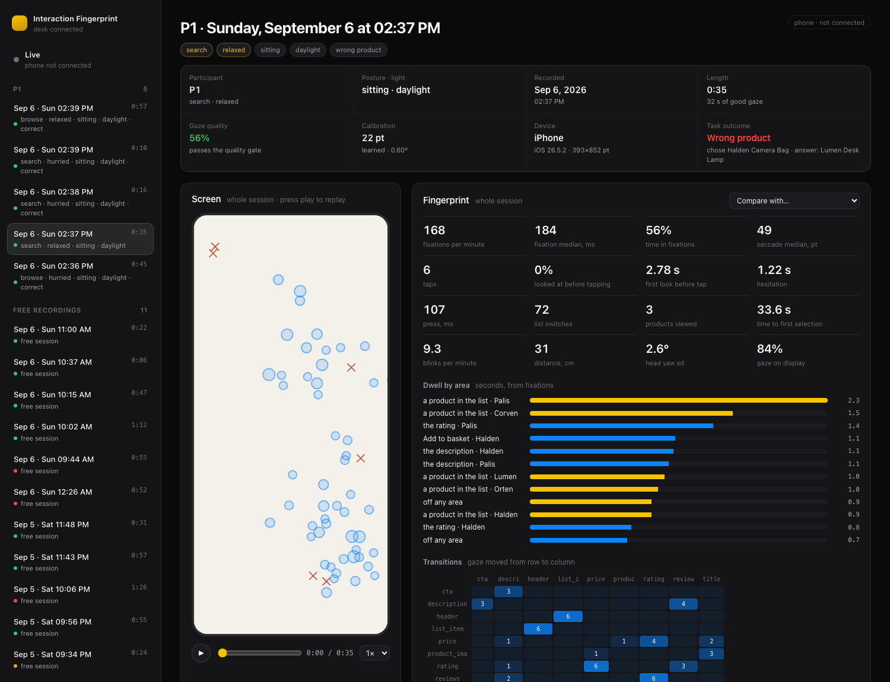
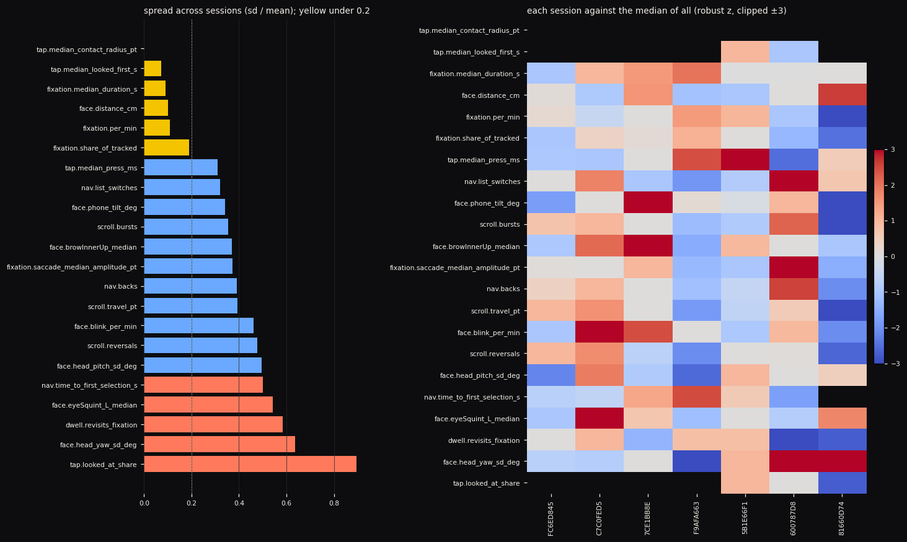
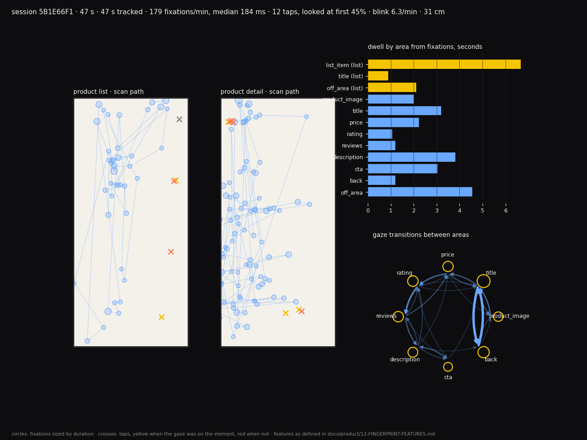
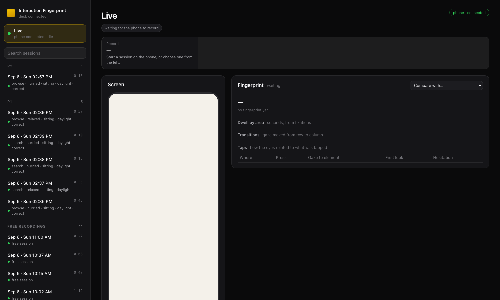

# Interaction Fingerprint

### What if product analytics could capture not just **what users do**, but **how they interact while making a decision**?

**Interaction Fingerprint** is an open research project exploring whether gaze, attention, hesitation, touch, navigation and other observable interaction signals can reveal patterns that conventional click-and-scroll analytics miss.

The project uses an iPhone's **TrueDepth camera + ARKit** as a sensing platform, a learned Core ML gaze model for screen-level gaze estimation, and a Python analysis pipeline that turns raw interaction events into a structured **Interaction Fingerprint**.

> **The goal is not to detect emotions.**
>
> The goal is to measure observable behaviour, preserve it as data, and investigate what that data can tell us about interaction.

Built and documented in the open by [Biswarup Mondal](https://github.com/ux-biswarup).



*The desk dashboard on the Mac: a recorded session with its record card, scan path, fingerprint, dwell by area and gaze transitions. Sessions stream from the phone over the local network as they are recorded.*

---

## The research question

Modern product analytics primarily tells us:

```text
Viewed → Clicked → Scrolled → Added to cart → Purchased
```

But a user's decision contains much more than those explicit events.

They may:

```text
Look → Pause → Revisit → Compare → Hesitate → Decide
```

The central question of this project is:

> **Can an Interaction Fingerprint reveal useful information about the user's interaction that conventional click-and-scroll analytics cannot?**

And, eventually:

> **Can an agent use that information to make a generative interface more adaptive?**

The second question comes later.

First, we need to establish that the fingerprint itself is measurable, reliable and useful. Where this sits among existing gaze, biometrics and attention research, and what it does and does not claim as new, is set out in [`docs/RESEARCH_MAP.md`](docs/RESEARCH_MAP.md).

---

# What is an Interaction Fingerprint?

An Interaction Fingerprint is a structured description of **how one person interacts with a digital interface over time**, built only from signals a device can observe.

It currently combines four layers:

| Layer           | Examples                                                                                       |
| --------------- | ---------------------------------------------------------------------------------------------- |
| **Explicit**    | taps, scrolls, back, selections, press duration, contact size                                  |
| **Behavioural** | dwell, revisits, gaze transitions, hesitation, list switching, time to decision                |
| **Perceptive**  | gaze position, fixations, saccades, blink rate, eye/brow movement, head pose, viewing distance |
| **Contextual**  | screen, product, task, study condition, phone movement, ambient light                          |

The important distinction is:

```text
OBSERVATION
eyeSquint_L = 0.42
gaze_dwell = 2.8s
revisit_count = 3
```

not:

```text
INTERPRETATION
confused = true
interested = true
dislikes_product = true
```

**Observations are recorded. Interpretations are derived separately and explicitly labelled.**

This distinction is a core research principle of the project.

---

# Why this matters

A conventional analytics system may tell a product team:

> “Users looked at the product and then left.”

An Interaction Fingerprint may eventually allow us to investigate:

> “Users repeatedly returned to the price after viewing the product images, spent disproportionate attention on reviews, and hesitated before selecting an alternative.”

The difference is subtle but important.

The first describes **an outcome**.

The second begins to describe **the interaction leading to the outcome**.

The long-term hypothesis is that this additional layer could become useful for:

* UX research
* product analytics
* personalization
* decision-friction analysis
* adaptive interfaces
* generative UI
* agentic interfaces
* product and marketing strategy

Those applications are hypotheses, not established findings of this project.

---

# The model

The project explores a progression from explicit analytics toward perceptive and eventually adaptive interfaces.

```text
                 USER
                  │
        ┌─────────┴─────────┐
        │                   │
    EXPLICIT             IMPLICIT
        │                   │
   taps / scroll        gaze / dwell
   selections           hesitation
                       revisits / movement
        │                   │
        └─────────┬─────────┘
                  ↓
         INTERACTION EVENTS
                  ↓
         FEATURE EXTRACTION
                  ↓
       INTERACTION FINGERPRINT
                  ↓
          ┌───────┴───────┐
          │               │
       RESEARCH         FUTURE
       ANALYSIS        ADAPTATION
                          │
                          ↓
                     AGENT / AI
                          │
                          ↓
                   GENERATIVE UI
```

The project currently focuses on the **measurement and analysis layers**.

Agentic adaptation comes only after the fingerprint has been validated across people.

---

# What can the iPhone observe?

The iPhone app uses the TrueDepth camera through ARKit and records observable signals including:

### Gaze

* screen-level gaze position
* eye-in-head orientation
* fixations
* saccades
* gaze transitions

### Eyes and brows

* blink rate
* eye openness
* nine eye/brow blend-shape coefficients
* left/right eye signals

### Head and device

* head pose
* viewing distance
* phone tilt
* phone motion

### Direct interaction

* taps
* scrolls
* selections
* press duration
* contact size
* areas of interest

The raw camera image is processed on-device. The research dataset contains numerical observations rather than photographs or video.

---

# How accurate is the gaze tracking?

This is one of the first questions any researcher using phone-based eye tracking should ask.

The current measurements were made on an **iPhone 15**, held approximately **30–40 cm** from the face.

| Gaze source                   |  Calibration grid | Free viewing: gaze → tapped element |
| ----------------------------- | ----------------: | ----------------------------------: |
| ARKit `lookAtPoint`           |         79–120 pt |                              256 pt |
| Apple Vision pupil landmarks  |          41–62 pt |                               60 pt |
| **Learned Core ML eye model** | **22 pt / ~0.6°** |           **28 pt median / 4.6 mm** |

The learned model is a small convolutional network trained using the public **MPIIFaceGaze** dataset and executed on-device.

A two-minute calibration substantially improves screen-level gaze estimation.

The full methodology, coordinate-frame corrections, calibration behaviour, motion handling and model evaluation are documented in:

* [`09-GAZE-ACCURACY.md`](docs/product/09-GAZE-ACCURACY.md)
* [`10-MOTION-FUSION.md`](docs/product/10-MOTION-FUSION.md)
* [`11-LEARNED-EYE-MODEL.md`](docs/product/11-LEARNED-EYE-MODEL.md)

> **Important:** These are measurements from this research setup, not a claim that iPhone gaze tracking is universally accurate at these levels.

---

# What we have found so far

The current evidence comes from **seven trustworthy sessions with one participant**.

That is enough to expose useful methodological patterns, but **not enough to make population-level claims**.

### 01 — Eye rhythm appears relatively stable

Across the seven sessions:

* median fixation duration: **184 ms**
* fixation rate: **168/min**
* both varied by approximately **10%** between sessions separated by a day and two calibrations

### 02 — Hands and head appear more state-dependent

For the same participant and task, measures such as:

* press duration
* scroll rhythm
* list switching
* blink rate
* head movement

varied substantially more.

This suggests that different signals may capture different aspects of interaction state.

### 03 — The fingertip is not gaze ground truth

A person may look at a row label and tap the right side of that row.

Comparing gaze against the fingertip therefore exaggerates apparent gaze error.

Comparing gaze against the **semantic element being targeted** produced substantially better results.

This matters when designing gaze-validation experiments.

### 04 — Data quality must be treated as a first-class signal

A session with less than approximately **40% of tracked time in fixations** can indicate poor calibration rather than unusual participant behaviour.

A useful Interaction Fingerprint therefore needs a **quality gate before interpretation**.



*Within-person spread of each feature over seven sessions of one participant (left, coefficient of variation; yellow under 0.2) and each session against the median of all (right). Produced by `Analysis/fingerprint_report.py`.*

---

# The current research hypothesis

The project is investigating three related hypotheses:

### H1 — Additional signal

> Interaction Fingerprints contain information about interaction that conventional click-and-scroll analytics do not capture.

### H2 — Decision friction

> Patterns such as attention, revisiting, hesitation and comparison may help identify decision friction before an explicit abandonment event.

### H3 — Adaptive interfaces

> If those patterns prove reliable, an agent could potentially use them to adapt a generative interface in response to the user's interaction state.

**H3 is intentionally future work.**

The current phase is focused on establishing H1 and investigating H2.

---

# The experiment

The initial study environment is a small instrumented shopping experience.

A participant interacts with products while the system records:

```text
Product
 ├── Image attention
 ├── Price attention
 ├── Rating attention
 ├── Review attention
 ├── CTA attention
 ├── Revisits
 ├── Gaze transitions
 ├── Hesitation
 ├── Comparison behaviour
 └── Decision outcome
```

This creates a controlled environment in which traditional analytics can eventually be compared against the richer Interaction Fingerprint.



*One session's fingerprint card: scan paths on the list and detail screens (circles are fixations sized by duration, crosses are taps, yellow when the gaze was on the element), dwell by area, and the transition graph between areas.*

The next phase is a repeated-measures study across multiple participants, with task, pace, posture and lighting deliberately controlled.

See:

* [`04-EXPERIMENT-PLAN.md`](docs/product/04-EXPERIMENT-PLAN.md)
* [`12-FINGERPRINT-FEATURES.md`](docs/product/12-FINGERPRINT-FEATURES.md)

---

# How it works

```text
                         iPhone
                            │
                  TrueDepth + ARKit
                            │
              ┌─────────────┼─────────────┐
              ↓             ↓             ↓
            Gaze        Face / eyes     Touch
              │             │             │
              └─────────────┼─────────────┘
                            ↓
                   Event instrumentation
                            ↓
                    Session event stream
                            │
                     Bonjour + WebSocket
                            │
                            ↓
                           Mac
                            │
                 ┌──────────┴──────────┐
                 ↓                     ↓
             Dashboard              Storage
                                       │
                                       ↓
                              Python analysis
                                       │
                                       ↓
                            Feature extraction
                                       │
                                       ↓
                          Interaction Fingerprint
```

### Sensing

ARKit provides face tracking and head pose. The app also records Vision pupil landmarks and the learned Core ML eye model.

Multiple gaze representations are stored so sessions can be reprocessed offline as the models improve.

### Instrumentation

Every gaze sample is associated with a semantic **Area of Interest (AOI)** declared in SwiftUI.

The raw coordinate is also retained.

This allows analysis to happen at both:

* geometric level
* semantic UI-element level

### Feature extraction

Fixations are detected using a dispersion-based method.

Higher-level features such as dwell, revisits and hesitation are calculated from fixations rather than individual samples, reducing boundary flicker.

### Study conditions

Task, pace, posture, lighting and other study conditions are stored with the session so their effects can be separated from normal within-person variation.

---

# Repository structure

```text
InteractionFingerprintPackage/
├── Tracking/
│   ├── ARKit face session
│   ├── display frame
│   ├── calibration
│   ├── gaze model
│   ├── motion gate
│   ├── Vision pupil landmarks
│   └── Core ML eye model
│
├── Instrumentation/
│   ├── event recorder
│   ├── touch observer
│   ├── areas of interest
│   └── desk link
│
├── Shop/
│   └── instrumented study stimulus
│
├── Views/
│   ├── calibration
│   ├── camera mirror
│   ├── study block
│   └── recording UI
│
└── Models/
    ├── event schema
    ├── session record
    └── study conditions

Analysis/
├── fingerprint/
├── eyemodel/
└── dashboard/

docs/product/
└── numbered research record (00–13)

Data/
└── local recordings — never committed
```

The iOS package currently contains **97 unit tests** and the Python analysis suite contains **36 tests**.

---

# Quick start

### Requirements

* Mac
* Xcode 26
* iPhone with Face ID / TrueDepth
* Physical iPhone — ARKit face tracking does not run in the Simulator

### 1. Configure the project

Copy:

```bash
Config/Local.xcconfig.example
```

to:

```bash
Config/Local.xcconfig
```

and set your development team.

Open:

```text
InteractionFingerprint.xcworkspace
```

Select the physical iPhone and run.

See [`DEVICE_INSTALL.md`](docs/DEVICE_INSTALL.md) for details.

### 2. Calibrate and record

On the iPhone:

1. Run the eye-label / wink check.
2. Complete the gaze calibration.
3. Calibration takes approximately two minutes.
4. Start a Shop session or study block.
5. Record the interaction.

### 3. Start the desk dashboard

On the Mac:

```bash
pip3 install --user -r Analysis/requirements.txt

python3 Analysis/dashboard/server.py --open
```

The dashboard is available at:

```text
http://localhost:8765
```

The iPhone discovers the Mac over the local network using Bonjour and streams sessions using WebSocket.



*The dashboard waiting for a recording: participants and sessions in the sidebar, newest first, with search; the live view fills as soon as the phone starts.*

### 4. Analyse a session

Evaluate gaze:

```bash
python3 Analysis/evaluate_gaze.py \
  Data/calibration_<t>.json \
  Data/session_<id>.jsonl
```

Generate one session's fingerprint:

```bash
python3 Analysis/fingerprint_session.py \
  Data/session_<id>.jsonl
```

Generate the cross-session report:

```bash
python3 Analysis/fingerprint_report.py
```

See [`12-FINGERPRINT-FEATURES.md`](docs/product/12-FINGERPRINT-FEATURES.md) for feature definitions and units.

---

# Research principles

### 1. Observe, don't label

Record measurable signals.

Do not turn a measurement into an assumed psychological state.

```text
eyeSquint_L = 0.42
```

is data.

```text
user_is_confused = true
```

is an interpretation.

### 2. Validate against behaviour

Whenever possible, compare perceptive signals against observable actions and reported outcomes.

### 3. Preserve uncertainty

A bad sensor reading should not become a behavioural conclusion.

### 4. Quality before interpretation

Every session needs a quality assessment before its features are used.

### 5. Separate sensing from inference

The sensing layer should remain useful even if the interpretation model changes.

### 6. Don't confuse correlation with intent

Gaze, facial movement and hesitation are signals of behaviour, not direct access to a person's thoughts, emotions or preferences.

---

# Privacy

The camera image is processed on-device by ARKit and **does not leave the device**.

The research dataset stores numerical observations such as:

* coordinates
* angles
* coefficients
* timings
* interaction events

It does not store:

* photographs
* video
* face meshes

Recordings remain in the researcher's local `Data/` directory.

The desk dashboard operates over the local network.

Participants are identified using research codes rather than names.

Before this project is used with participants outside the research team, it requires an appropriate:

* consent flow
* privacy notice
* data handling protocol
* applicable ethical review
* applicable data protection assessment

See [`06-RESEARCH-PRINCIPLES.md`](docs/product/06-RESEARCH-PRINCIPLES.md).

---

# What this project is — and isn't

### This is

* an open research instrument
* an iPhone-based interaction sensing system
* a gaze and interaction measurement toolkit
* a structured feature pipeline
* an experiment into Interaction Fingerprints
* a foundation for research into adaptive interfaces

### This is not

* an emotion detector
* a mind-reading system
* a claim that gaze equals preference
* a production-ready biometric analytics SDK
* a system that currently predicts user intent
* a system that currently adapts the interface automatically

Those are questions for future research.

---

# Roadmap

The project is deliberately being developed in stages. The numbering follows [`07-ROADMAP.md`](docs/product/07-ROADMAP.md), where each phase's exit criterion and evidence are recorded.

```text
PHASE 0
Setup
    ✓

PHASE 1
Sensing — gaze accurate enough against what people tap
    ✓

PHASE 2
Instrumentation — every gaze sample attributed to a UI element
    ✓

PHASE 3
Fingerprint — features, cards, stability, live dashboard
    ✓

PHASE 4
Repeated-measures study across a few participants
    → Current

PHASE 5
Modelling — which signal combinations carry information
    → Next

PHASE 6
Adaptive prototype with predefined interventions
    → Future

PHASE 7
Agentic + generative UI
    → Future

PHASE 8
Research artifact — report, case study, public write-up
    → Future

PHASE 9
Optional academic paper
    → Future
```

The principle is simple:

> **Don't build the agent before establishing that there is something useful for the agent to understand.**

---

# Where this could go

If the research supports the hypothesis, Interaction Fingerprint could become a foundation for exploring a new interaction loop:

```text
             USER
               ↓
          OBSERVATION
               ↓
     INTERACTION FINGERPRINT
               ↓
             AGENT
               ↓
       INTERPRETATION
               ↓
         GENERATIVE UI
               ↓
          ADAPTATION
               ↓
             USER
               ↺
```

This could eventually be explored in:

* e-commerce
* AI assistants
* productivity tools
* learning interfaces
* complex enterprise software
* analytics
* content discovery

The goal is not to make interfaces "read minds."

The goal is to investigate whether interfaces can become **more perceptive without becoming presumptive**.

---

# Research status

**Current status:** sensing, instrumentation and initial fingerprint extraction are working.

**Evidence:** seven trustworthy sessions from one participant, with documented gaze accuracy and within-person stability measurements.

**Next milestone:** repeated-measures data across multiple participants.

**Open question:**

> **Does an Interaction Fingerprint contain stable, actionable information about how people interact—and can that information eventually make interfaces more adaptive?**

That is the question this project is trying to answer.

---

# Research documentation

The research record is maintained alongside the code:

* [`RESEARCH_MAP.md`](docs/RESEARCH_MAP.md) — the existing landscape, related open-source projects and datasets, and the precise line this project claims as its own
* [`01-RESEARCH-THESIS.md`](docs/product/01-RESEARCH-THESIS.md)
* [`02-INTERACTION-FINGERPRINT.md`](docs/product/02-INTERACTION-FINGERPRINT.md)
* [`04-EXPERIMENT-PLAN.md`](docs/product/04-EXPERIMENT-PLAN.md)
* [`05-DATA-SCHEMA.md`](docs/product/05-DATA-SCHEMA.md)
* [`06-RESEARCH-PRINCIPLES.md`](docs/product/06-RESEARCH-PRINCIPLES.md)
* [`07-ROADMAP.md`](docs/product/07-ROADMAP.md)
* [`09-GAZE-ACCURACY.md`](docs/product/09-GAZE-ACCURACY.md)
* [`10-MOTION-FUSION.md`](docs/product/10-MOTION-FUSION.md)
* [`11-LEARNED-EYE-MODEL.md`](docs/product/11-LEARNED-EYE-MODEL.md)
* [`12-FINGERPRINT-FEATURES.md`](docs/product/12-FINGERPRINT-FEATURES.md)
* [`13-DESK-LINK.md`](docs/product/13-DESK-LINK.md)

---

# References

The learned eye model was trained using the public **MPIIFaceGaze** dataset.

> Zhang, Xucong, Yusuke Sugano, Mario Fritz, and Andreas Bulling. “It's Written All Over Your Face: Full-Face Appearance-Based Gaze Estimation.” CVPR Workshops, 2017.

See the model documentation for licensing and research-use requirements.

---

# Citation

If you use this project in research:

```text
Mondal, B. (2026).
Interaction Fingerprint: an open iPhone gaze and interaction research kit.
GitHub.
https://github.com/ux-biswarup/interaction-fingerprint
```

---

## License

Code is licensed under the MIT License.

See [`LICENSE`](LICENSE) for details.

> **Research in the open. Measurements before assumptions.**

<sub>Keywords: iPhone eye tracking, ARKit gaze tracking accuracy, TrueDepth gaze estimation, appearance-based gaze estimation on mobile, Core ML eye model, MPIIFaceGaze, gaze calibration iOS, fixation detection, areas of interest SwiftUI, interaction analytics beyond clicks, gaze-before-tap validation, open-source eye tracking iOS, perceptive interfaces, adaptive generative UI research.</sub>
